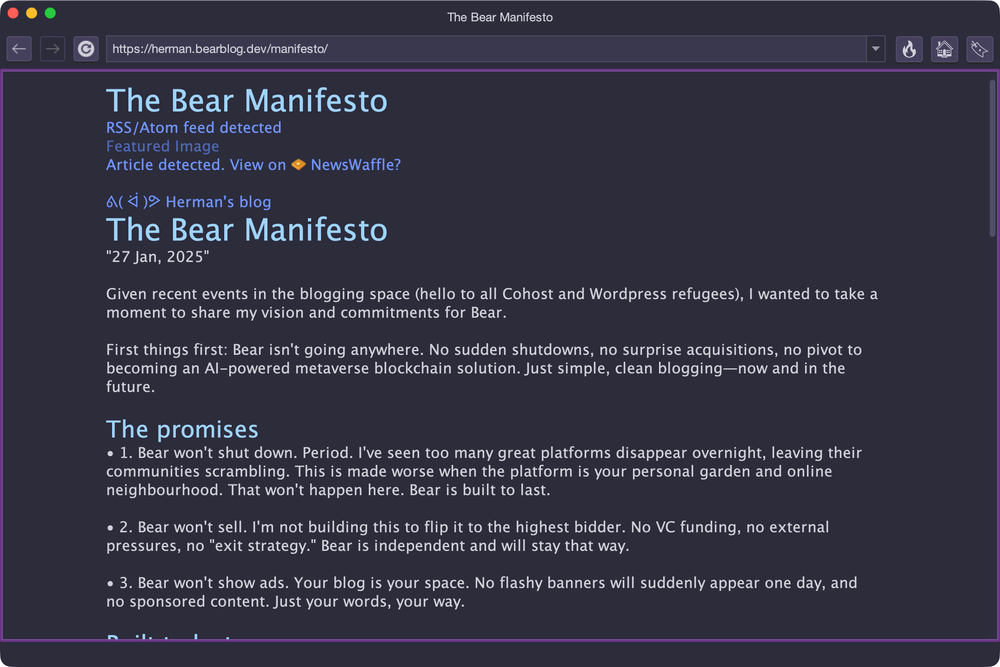

# Stargate 💫🚪
A Gemini-to-HTTP gateway proxy for the small web

Stargate is an HTTP-to-Gemini proxy that enables users to browse web content from inside Gemini clients. It acts as a bridge between the simpler, minimalistic Gemini protocol and HTTP, offering a unique way to read web content without sacrificing the simplicity of Gemini.



## Features

- Integrates with most popular Gemini clients including [Lagrange](https://github.com/skyjake/lagrange?utm_source=chatgpt.com), [Alhena](https://github.com/mochaman/alhena), and [Amfora](https://github.com/makew0rld/amfora).
- Automatically converts cluttered HTML into clean and readable Gemtext by detecting common page elements like navigation and article blocks, while ignoring invisible content, and re-writes the content to be more readable.
- Converts HTML tables into readable ASCII/Unicode tables inside preformatted text blocks.  
- Supports source sets in `` and `<picture>` tags selecting the most appropriate version.
- Transparently converts advanced image formats (WebP, SVG) into PNG/JPEG image supported by most Gemini clients.
- Resizes images on-the-fly to sizes more appropriate for a Gemini browser.
- Auto-detects RSS/Atom feeds and renders them as Gemtext to more easily find and navigate content.
- Auto-detects news stories and provides a link to [NewsWaffle service](https://github.com/acidus99/NewsWaffle).
- Supports Brotli/gzip compression for HTTP transfers to download content more quickly.


## Public Instance
You can play with a public instance of Stargate by configuring your Gemini client to use `stargate.gemi.dev:1994` as an HTTP proxy, and your browser to an HTTP(S) page.

## Downloads  

Prebuilt binaries are available for:  

- macOS (Apple Silicon + Intel)  
- Linux (x64) 
- Windows (x64) 

Check the [Releases](https://github.com/acidus99/stargate-proxy/releases) page to grab the right one for your system.  

## Usage

The simplest way to use Stargate is to run it on the command line:
```
$ stargate
Stargate 1.1 💫🚪 Gemini-to-HTTP proxy
No certificate and private key specified. Generating new certificate/private key. Created files are:
Certificate file path: "/home/acidus/localhost-proxy.crt"
Private key file path: "/home/acidus/localhost-proxy.key"
Proxy started on localhost:1994
```
You then configure your Gemini client to use `localhost:1994` as an HTTP proxy, and you are good to go!

### Command-line Options

- `-h, --host=VALUE` Hostname to listen on (default: *localhost*).  
- `-p, --port=VALUE` TCP port to listen on (default: *1994*).  
- `-c, --cert=VALUE` Path to TLS certificate file (PEM/CRT). *If provided, `--key` is required.*  
- `-k, --key=VALUE` Path to private key file (PEM). *If provided, `--cert` is required.*  
- `-v, --version` Show version and exit.  
- `--help, -?` Show help and exit.  

## FAQ  

**Q: What is Stargate, really?**  
A Gemini-to-HTTP proxy. It fetches web content, translates it into Gemtext, and serves it over Gemini.  

**Q: Why would I use this?**  
- Stay in Gemini while still checking out web resources  
- Read cleaner, ad-free versions of web pages  
- Protect your focus and privacy  

**Q: Does it work with all sites?**  
Static HTML, blogs, and articles work best. Dynamic, JavaScript-heavy sites or web applications won’t render correctly. Due to the nature of Gemtext and Gemini, interactive elements like forms will not work.

**Q: How do I report bugs or request features?**  
Open an issue on the GitHub repo. Feedback is always welcome, but may not be taken.

## Compiling from Source

### Prerequisites
- **.NET SDK 8.0+** (`dotnet --info` should work)

### 1) Clone Repository and Dependencies

Stargate uses sibling project references to its dependencies. Keep all four repos as siblings to each other in the same parent folder, as shown below:

```bash
# choose any parent folder
mkdir stargate-src && cd stargate-src

# clone all four repos as siblings
git clone https://github.com/acidus99/stargate-proxy.git
git clone https://github.com/acidus99/Gemini.Net.git
git clone https://github.com/acidus99/HtmlToGmi.git
git clone https://github.com/acidus99/RocketForce.git
```

Resulting layout:

```
stargate-src/
├─ stargate-proxy/
├─ Gemini.Net/
├─ HtmlToGmi/
└─ RocketForce/
```

### 2) Build & publish Stargate

```bash
dotnet publish stargate-proxy/Stargate.csproj -c Release -o ./publish
```

You now have a framework dependent executable in the `publish/` directory.

```bash
cd publish
./stargate
```
